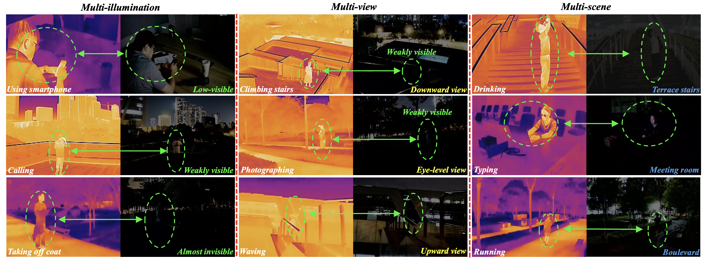
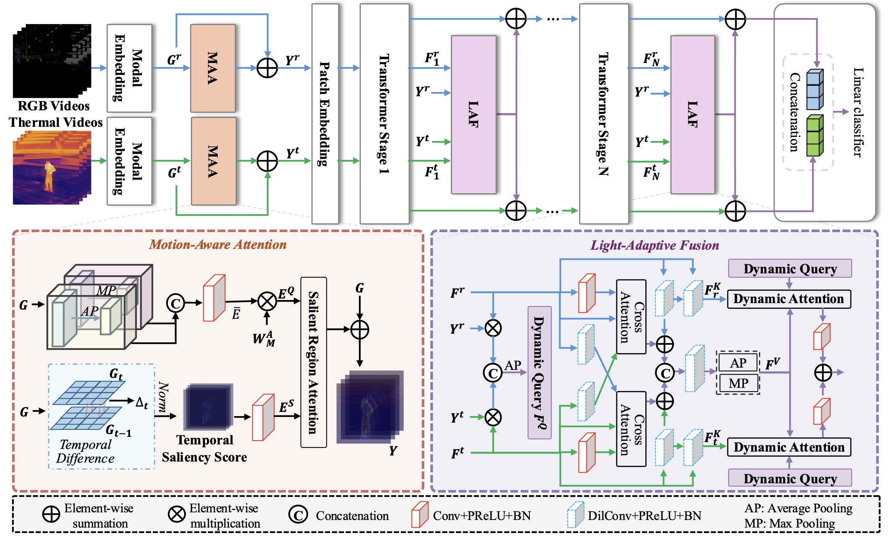
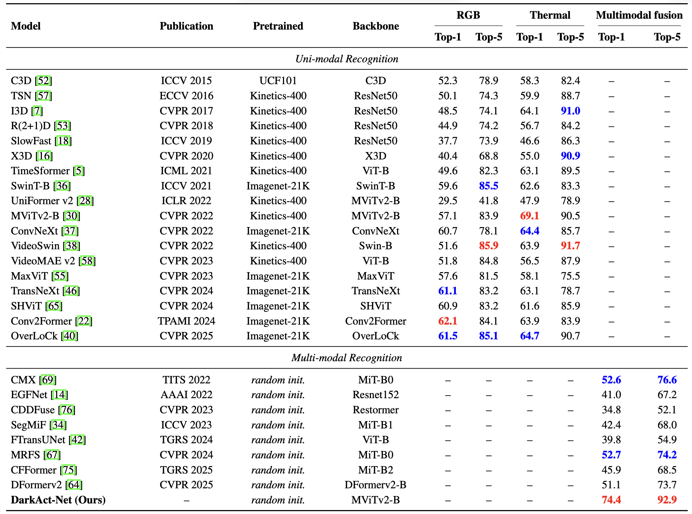

# DarkAct: A RGB-Thermal Dataset and Fusion Framework for Multimodal Low-Light Action Recognition
[](https://cvpr.thecvf.com/)
[](LICENSE)
[](https://www.python.org/)
[](https://pytorch.org/)

Official implementation of **DarkAct** (CVPR 2026), a large-scale RGB-Thermal video dataset and a dedicated fusion framework for robust human action recognition under low-light conditions.

Recently, we have expand our datasets to VQA which named as DarkAct++.


_Overview of the DarkAct dataset. DarkAct captures diverse human actions under challenging low-light conditions across three dimensions: (1) Multi-Illumination: varying visibility levels ranging from weakly visible to almost invisible scenes; (2) Multi-View: actions observed from upward, eye-level, and downward viewpoints; and (3) Multi-Scene: recordings from a wide range of indoor and outdoor environments. Each RGB frame is paired with a precisely aligned thermal frame, providing strong cross-spectral complementarity for robust action recognition in dark environments._

**Paper**: [CVPR2026_DarkAct_Yuanjun_main.pdf](CVPR2026_DarkAct_Yuanjun_main.pdf)

**Dataset & Code**: This repository contains the full implementation of DarkAct-Net, dataset download links, and benchmarking scripts.

## 📌 Project Overview
Human action recognition (HAR) in low-light environments is severely challenged by degraded visibility, illumination variance, and loss of appearance cues. We address this gap by:
1. **Constructing DarkAct**: The **first large-scale high-quality RGB-Thermal video dataset** for low-light HAR, with diverse illumination, viewpoints, and scenes.
2. **Benchmarking State-of-the-Art Models**: Systematically evaluate unimodal HAR, multimodal fusion, and vision-language foundation models (VLMs) on DarkAct, revealing their limitations in low-light cross-spectral scenarios.
3. **Proposing DarkAct-Net**: A novel RGB-Thermal fusion framework with **Motion-Aware Attention (MAA)** and **Light-Adaptive Fusion (LAF)** modules, achieving SOTA performance for low-light action recognition.

## 📊 DarkAct Dataset
### Core Features
DarkAct is designed with **three key dimensions of diversity** for realistic low-light HAR scenarios:
- **Multi-Illumination**: Varying visibility from weakly visible to almost invisible.
- **Multi-View**: Upward, eye-level, and downward viewing angles.
- **Multi-Scene**: Diverse indoor/outdoor environments (terraces, corridors, squares, bedrooms, etc.) in urban/rural central China.

### Data Statistics
| Item | Details |
|------|---------|
| Total Paired RGB-T Videos | 12,778 |
| Action Categories | 27 (daily human actions, e.g., walking, drinking, typing, squatting) |
| Training/Test Split | 9,040 / 3,738 |
| Frame Rate | 30 fps |
| Total Duration | ~19.2 hours |
| Video Duration | 4.5 ~ 19.1s (avg. 5.4s) |
| Volunteers | 11 adults (7 male, 4 female) |
| Capture Device | Dahua DH-TPC-BF2241 binocular camera (RGB + Thermal-Infrared) |

### Action Categories
Walking, calling, running, pouring, using smartphone, clapping, photographing, picking up object, jumping, pushing, taking off coat, putting on coat, drinking, searching, sitting, closing door, squatting, standing, turning, typing, climbing stairs, waving, holding umbrella, opening door, sleeping, lifting, crouching.

### Dataset Download
The full DarkAct dataset (RGB-T video pairs, train/test splits, annotations) is available for research use at:
[DarkAct Dataset Download](https://github.com/darkact-creator/DarkAct)

## 🚀 DarkAct-Net Architecture
DarkAct-Net is a Transformer-based RGB-Thermal fusion framework built on **MViTv2** backbone, optimized for low-light HAR with two core modules:



### 1. Motion-Aware Attention (MAA)
- Extracts **human-centric motion-salient regions** by computing temporal frame differences and enhancing local contrast.
- Suppresses noisy low-light backgrounds and mitigates RGB-T pixel misalignment with a **spatial-tolerant attention map**.
- Emphasizes motion-discriminative features for robust action representation.

### 2. Light-Adaptive Fusion (LAF)
- Inserted after each Transformer stage for **adaptive cross-modal fusion** based on scene illumination and modality reliability.
- Constructs a **light-adaptive query** encoding motion saliency and illumination cues.
- Fuses RGB and Thermal features via dynamic cross-attention, achieving balanced complementarity between the two modalities.

### Overall Pipeline
```
RGB/Thermal Videos → Patch Embedding → MAA Module (Motion Enhancement) → MViTv2 Transformer → LAF Module (Adaptive Fusion) → Classification Head → Action Prediction
```

## 📈 Experimental Results
### Key Benchmark Results (Top-1 / Top-5 Accuracy)



Evaluated on the DarkAct test set, DarkAct-Net outperforms all unimodal and multimodal SOTA methods:
| Model Type | Best Performance | DarkAct-Net Performance |
|------------|------------------|------------------------|
| RGB-only Unimodal | 62.1% / 84.1% (Conv2Former) | - |
| Thermal-only Unimodal | 69.1% / 90.5% (MViTv2-B) | - |
| Multimodal Fusion (SOTA) | 52.7% / 74.2% (MRFS) | **74.4% / 92.9%** |

### VLM Zero-Shot Performance
All evaluated VLMs achieve **<20% Top-1 accuracy** on DarkAct, demonstrating severe generalization degradation in low-light cross-spectral scenarios.

### Ablation Study
Both MAA and LAF are critical for DarkAct-Net's performance (Top-1 Accuracy):
| Model Variant | Top-1 Accuracy |
|---------------|----------------|
| DarkAct-Net (Full) | 74.4% |
| w/o MAA | 71.2% |
| w/o LAF | 72.3% |
| w/o MAA + LAF | 70.9% |

### Robustness Analysis
DarkAct-Net shows **superior robustness** to:
- **Human-camera distance**: Minimal performance drop from near to far distance (unlike unimodal models).
- **Viewpoint variation**: Nearly uniform accuracy across upward/eye-level/downward views (existing models exhibit large fluctuations).

## 🔧 Usage
### 1. Environment Setup
Clone the repository and install dependencies:
```bash
# Clone repo
git clone https://github.com/darkact-creator/DarkAct.git
cd DarkAct

# Create conda environment
conda create -n darkact python=3.9
conda activate darkact

# Install dependencies
pip install -r requirements.txt
# Install PyTorch (match your CUDA version)
pip install torch==2.0.1 torchvision==0.15.2 torchaudio==2.0.2 --index-url https://download.pytorch.org/whl/cu118
```

### 2. Dataset Preparation
1. Download the DarkAct dataset from the [download link](#dataset-download).
2. Unzip the dataset and organize the directory as follows:
```
DarkAct/
├── data/
│   ├── train/
│   │   ├── rgb/
│   │   ├── thermal/
│   │   └── annotations.json
│   └── test/
│       ├── rgb/
│       ├── thermal/
│       └── annotations.json
├── models/
├── scripts/
└── main.py
```

### 3. Train DarkAct-Net
Run the training script with default settings (MViTv2-B backbone, dual RTX A800 GPUs):
```bash
python main.py --mode train --data_path ./data --backbone mvitv2_b --batch_size 8 --epochs 120 --lr 1e-3
```

### 4. Test DarkAct-Net
Evaluate the trained model on the DarkAct test set:
```bash
python main.py --mode test --data_path ./data --backbone mvitv2_b --ckpt_path ./checkpoints/best_model.pth
```

### 5. Benchmark Other Models
We provide benchmarking scripts for unimodal (RGB/Thermal) and multimodal SOTA models in `./scripts/`:
```bash
# Benchmark RGB-only MViTv2-B
python scripts/benchmark_unimodal.py --modality rgb --backbone mvitv2_b

# Benchmark Thermal-only Conv2Former
python scripts/benchmark_unimodal.py --modality thermal --backbone conv2former

# Benchmark existing multimodal fusion model MRFS
python scripts/benchmark_multimodal.py --model mrfs
```

## 📝 Citation
If you use DarkAct dataset or DarkAct-Net in your research, please cite our paper:
```bibtex
@inproceedings{tan2026darkact,
  title={DarkAct: A RGB-Thermal Dataset and Fusion Framework for Multimodal Low-Light Action Recognition},
  author={Tan, Yuanjun and Xiao, Aoran and Deng, Liqian and Tu, Zhigang},
  booktitle={Proceedings of the IEEE/CVF Conference on Computer Vision and Pattern Recognition (CVPR)},
  year={2026}
}
```

## 🙏 Acknowledgements
This work was supported by:
- NSFC Regional Innovation and Development Joint Fund (Grant U25A20537)
- National Key Research and Development Program of China (No. 2024YFC3015600)

We thank the volunteers for participating in the data collection and the third-party team for data quality control. We promise that all video data will not be used for ethical-related tasks such as face recognition or biometric information retrieval, and the dataset is only applicable to academic research.
List of our volunteers:
- Zirui Wang(王子睿): wangzirui.0426@bytedance.com
- Yanda Li(李彦达)
- Zhaobo Guo(郭兆博)
- Gaoyang Ji(姬高阳)
- Zheng Wang(王政)
- Liqian Deng(邓李茜)
- Yue Bai(白悦)
- Xu Pan(潘旭)
- Guotao Chen(陈国涛)
- Yuanjun Tan(谭元骏): yuanjuntan@whu.edu.cn
- Minqi Song(宋敏齐)

## 📧 Contact
For questions about the dataset or code, please contact:
- Yuanjun Tan: yuanjuntan@whu.edu.cn
- Aoran Xiao: aoran.xiao@hit.edu.cn
- Zhigang Tu (Corresponding): tuzhigang@whu.edu.cn

## 📄 License
This project is licensed under the **MIT License** - see the [LICENSE](LICENSE) file for details. The DarkAct dataset is for **non-commercial research use only**.
